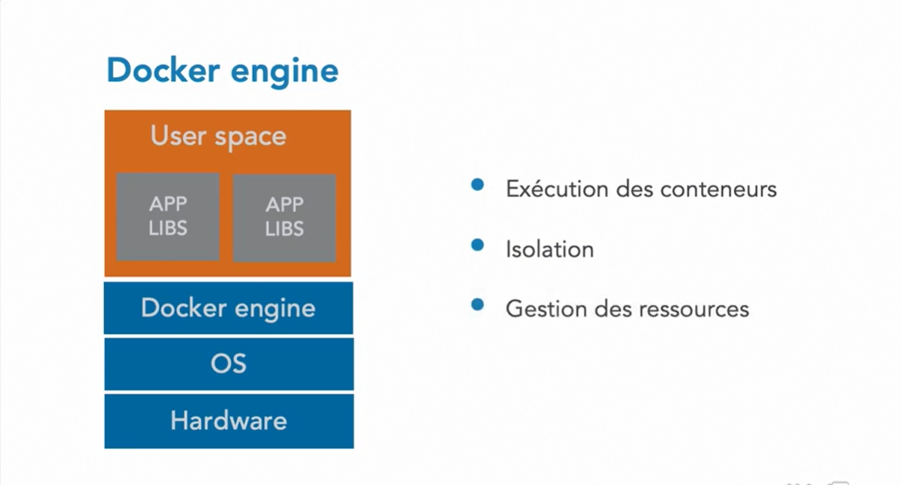

# essentiel-de-Kubernetes
Si vous avez des applications conteneurisées à déployer et à mettre à jour, découvrez cette formation sur Kubernetes. Ce système open source va notamment vous permettre de faire évoluer vos services pour répondre aux montées en charge. Samir Lakhdari, consultant expert en IT, vous explique comment utiliser Kubernetes comme orchestrateur de vos applications. Ensemble, vous verrez comment déployer et rendre des applications disponibles dans un environnement semblable à votre site de production. Ainsi, vous tirerez parti de la puissance de l'outil ainsi que des solutions qu'il vous apportera.

## Qu'est ce que Kubernates

## Deploiement

## Historique des containers

## Docker
### Architecture docker

### Docker engine

### Image docker

### Conteneur docker

### Avantages des conteneurs docker

