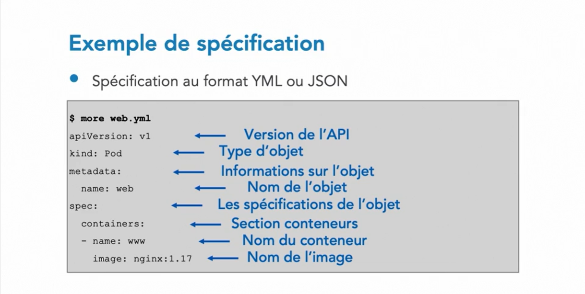

# essentiel-de-Kubernetes
Si vous avez des applications conteneurisées à déployer et à mettre à jour, découvrez cette formation sur Kubernetes. Ce système open source va notamment vous permettre de faire évoluer vos services pour répondre aux montées en charge. Samir Lakhdari, consultant expert en IT, vous explique comment utiliser Kubernetes comme orchestrateur de vos applications. Ensemble, vous verrez comment déployer et rendre des applications disponibles dans un environnement semblable à votre site de production. Ainsi, vous tirerez parti de la puissance de l'outil ainsi que des solutions qu'il vous apportera.

## Qu'est ce que Kubernates

## Deploiement

## Historique des containers

## Docker
### Architecture docker

### Docker engine

### Image docker

### Conteneur docker

### Avantages des conteneurs docker

## S'initier à kubernates
### Historique

### Qu'est ce que kubernates

## Utiliser la terminologie Kubernates
### Cluster Kubernates

### Les Pod Kubernates

### Le deployement Kubernates

### Les Services Kubernates

### Les Clients Kubernates

### Les Noeuds Kubernates

### Les Workers Kubernates

## Parcourir l'architecture de Kubernates
### Architeture générale de Kubernates

### Les Composants du Master

### Les Composants du Worker

### Accèss au cluster Kubernates

## Les ressources utilisées par le cluster K8s

### La Gestion des Ressources

### Le load balancing

### La configuration des applications

### Le stockages de données

### La configuration de cluster

## Définir le format des spécifications des ressources
### Les clés de définition
#### Les clé apiVersion et kind

#### la clé metadata et spec

## Les Pod

## Exemple de spécification(yml ou json) 

## Installation de Kubernates
### Types d'installation
#### Solutions locales et hebergées

#### Solution On-Premise

#### Minikube

#### Docker Desktop

#### Kubeadm

## Context

## Configuration 

## Quelques commandes

## Liens utils pour kubernates
* [Lien pour installer kubectl](https://kubernetes.io/docs/tasks/tools/install-kubectl-linux/)
* [VPS pour kubernates](https://contabo.com/en/vps/?utm_source=adwords&utm_medium=cpc&utm_campaign=vps&gclid=Cj0KCQjwse-DBhC7ARIsAI8YcWLIbu5nIvefqXnFB0Xdmc87cIk70F1C2OA3dlPBCkZelWD6aiVBG7AaAo9eEALw_wcB)
